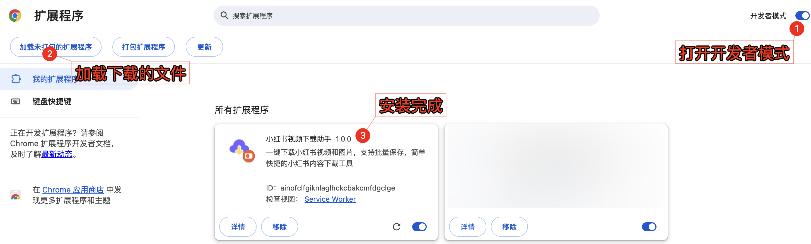

# 小红书下载助手 - Chrome扩展

Chrome浏览器扩展，支持下载小红书平台的视频和图片内容。

## 🌟 功能特点

- ✅ **视频下载**：保存小红书视频到本地
- 🖼️ **图片下载**：保存图文笔记中的图片

## 📱 支持内容类型

- **视频内容**：小红书视频笔记（MP4格式）
- **图片内容**：图文笔记中的图片（JPG/PNG格式）

## 📦 安装方法

1. 下载本项目代码到本地
2. 打开Chrome浏览器，访问 `chrome://extensions/`
3. 开启右上角的「开发者模式」
4. 点击「加载已解压的扩展程序」
5. 选择项目文件夹

## 🚀 使用方法

1. 打开小红书网站 [www.xiaohongshu.com](https://www.xiaohongshu.com)
2. 进入视频或图文详情页
3. 点击页面右上角的悬浮按钮
4. 选择要下载的视频或图片
5. 文件将保存到浏览器默认下载文件夹

## ⚠️ 免责声明

本工具仅供个人学习研究使用，请遵守相关法律法规和平台服务条款。
